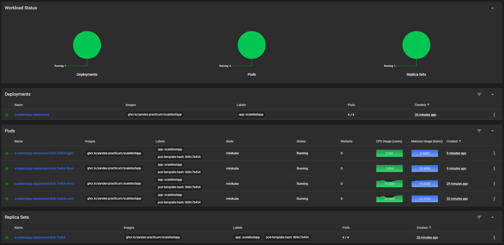
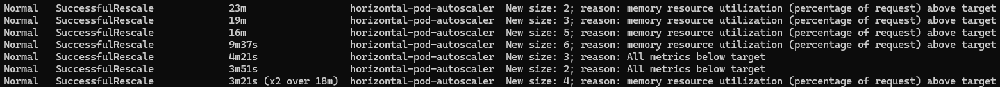
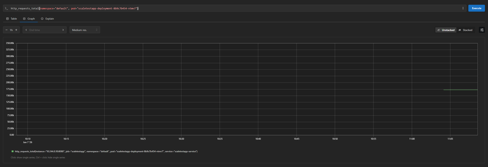
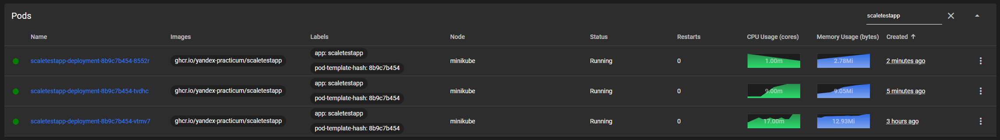
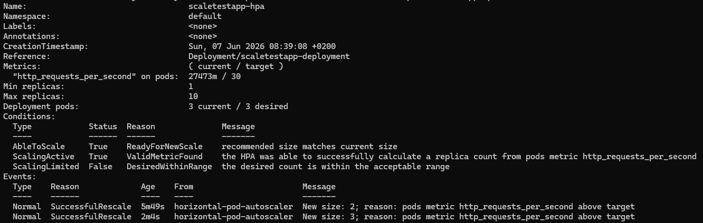
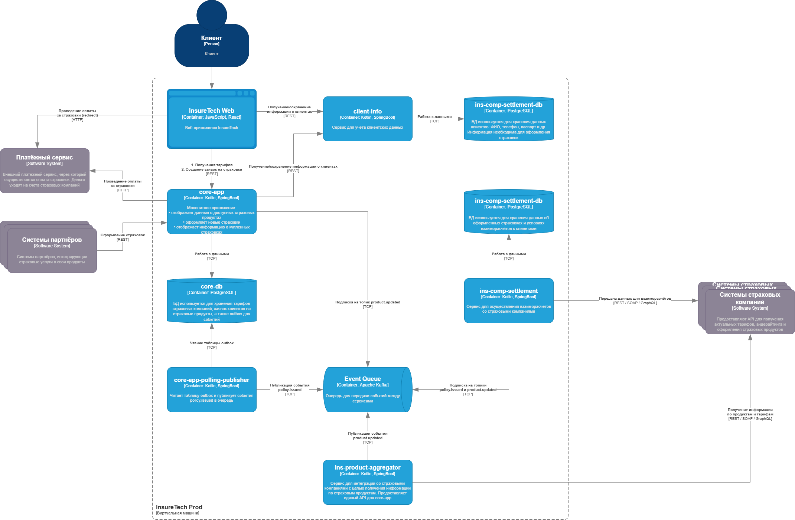
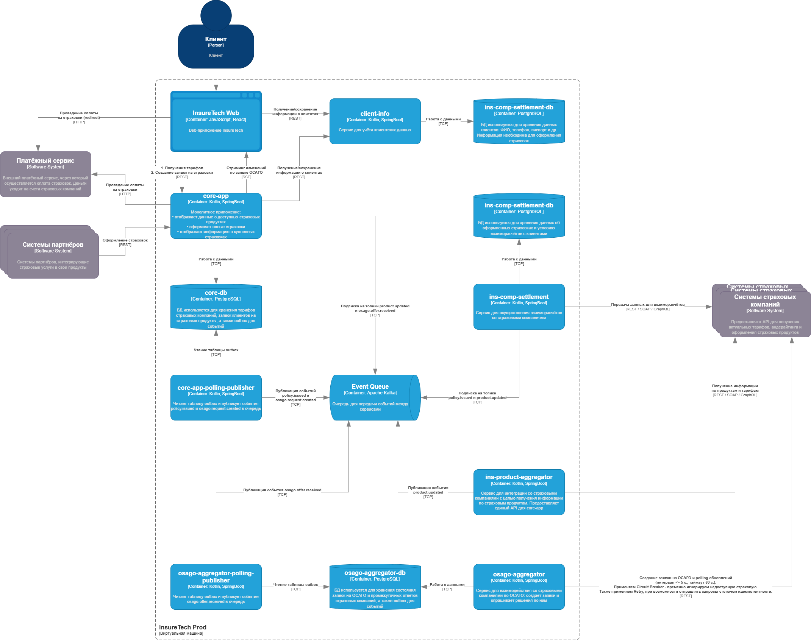

# Проектная работа

## Задание 1

## Задание 2

* [Deployment](Task2/deployment.yaml)
* [Service](Task2/service.yaml)
* [HPA (memory)](Task2/hpa-mem.yaml)
* [HPA (RPS)](Task2/hpa-rps.yaml)

**Dashboard (memory)**

**Logs (memory)**

**Metrics**

**Dashboard (RPS)**

**Logs (RPS)**

## Задание 3

[Анализ проблем и рисков.](Task3/problems_analysis.md)

**Обновленная диаграмма**

## Задание 4

## Задание 5

[Схема](Task5/schema.graphql)

## Задание 6

[Конфигурация nginx](Task6/nginx.conf)
